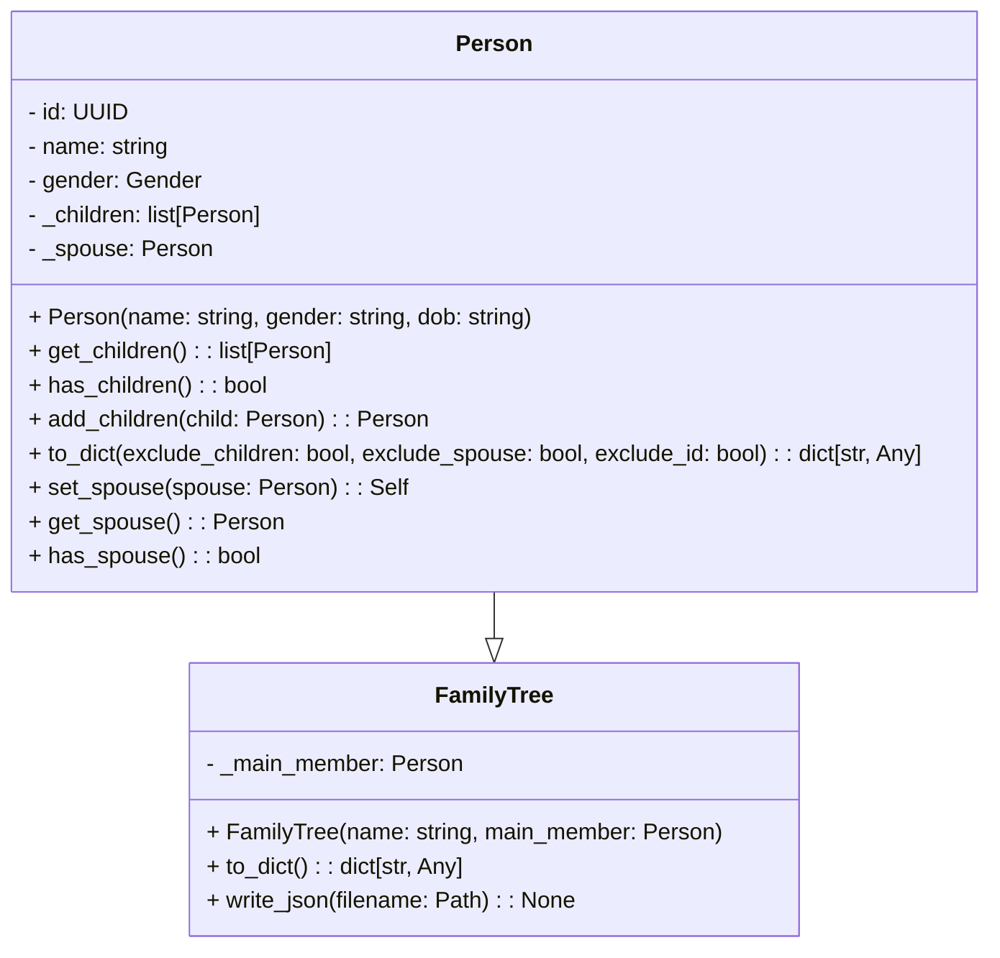
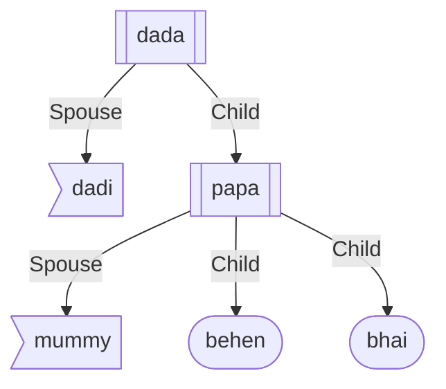

# Family Tree

Create family tree using python and export it as [JSON](#as-json) or [`mermaid`](#as-mermaid) format.

<!-- TODO: Add badges after creating a CLI tool using python. -->

## Class Diagram



## Example

These code snippets demonstrate the creation of a family tree with grandparents, parents, and children, and how to visualize it using the `FamilyTree` class. Additionally, the example shows how to export the family tree data to a JSON file for further analysis or sharing.

Import necessary modules and classes:

```python
from family_tree.family_tree import FamilyTree, Gender, Person
```

Create individuals and define relationships:

```python
# Define grandparents
dada = Person("dada", Gender.MALE)
dadi = Person("dadi", Gender.FEMALE)
dada.set_spouse(dadi)

# Define parents and link them to grandparents
papa = Person("papa", Gender.MALE)
mummy = Person("mummy", Gender.FEMALE)
papa.set_spouse(mummy)
dada.add_children(papa)

# Define children and link them to parents
bhai = Person("bhai", Gender.MALE)
behen = Person("behen", Gender.FEMALE)
papa.add_children(bhai, behen, bhai)
```

> \[!NOTE\]
>
> Adding bhai twice as a child will not create two separate children; instead, one is ignored because Python's set class is used to manage children.
>
> Additionally, if you add children to 'papa' (i.e., `papa.add_children(...)`), they will also be added to 'papa's' spouse ('mummy') if the spouse is already set or will be set later in the code.

Create a family tree and visualize it:

```python
# Create a family tree with "DADA" as the main member
tree = FamilyTree("DADA", dada)
```

#### As JSON

Export the family tree data to a JSON file:

```python
from pathlib import Path

# Write family tree data to a JSON file
tree.write_json(Path("family_tree.json"))
```

#### As Mermaid

Print the family tree in 🧜‍♀️ [`mermaid`](https://mermaid.js.org) format:

```python
from family_tree.draw import generate_mermaid_family_tree

generate_mermaid_family_tree(dada)
```

<details>
<summary>Plain Text Output</summary>

```
graph TD;
  2b7f6209-8978-4690-b43d-b4b5ed415c4d[[dada]];
  92eb4aed-3989-4f4f-9a4c-9051243901c7>dadi];
  ba063ad6-6973-45cb-9949-87a761e8ab00[[papa]];
  7da84ea1-61c6-4098-97a2-7b1d20c00063>mummy];
  c1013fb7-c8ab-4fa6-a86a-c5ed3379348f([behen]);
  37a58f3f-4ef4-42a6-abdb-db13d31cdefa([bhai]);

  2b7f6209-8978-4690-b43d-b4b5ed415c4d --> |Spouse| 92eb4aed-3989-4f4f-9a4c-9051243901c7;
  2b7f6209-8978-4690-b43d-b4b5ed415c4d --> |Child| ba063ad6-6973-45cb-9949-87a761e8ab00;
  ba063ad6-6973-45cb-9949-87a761e8ab00 --> |Spouse| 7da84ea1-61c6-4098-97a2-7b1d20c00063;
  ba063ad6-6973-45cb-9949-87a761e8ab00 --> |Child| c1013fb7-c8ab-4fa6-a86a-c5ed3379348f;
  ba063ad6-6973-45cb-9949-87a761e8ab00 --> |Child| 37a58f3f-4ef4-42a6-abdb-db13d31cdefa;
```

</details>



> \[!IMPORTANT\]
>
> You can also draw using:
>
> - `networkx` (install with `pip`)
> - `graphviz` (graphviz requires some additional deps).

## Author

Created with ❤️ by [**arv-anshul**][arv-anshul] using ChatGPT 🤖.

[arv-anshul]: https://github.com/arv-anshul
